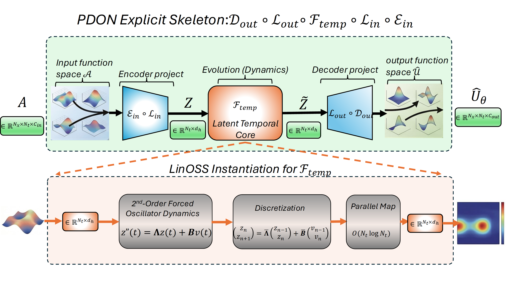
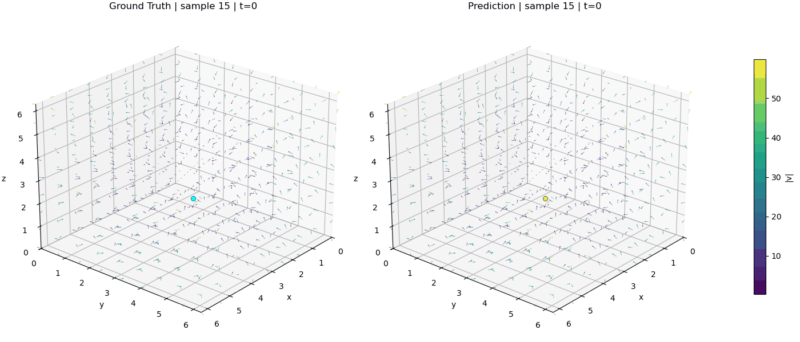
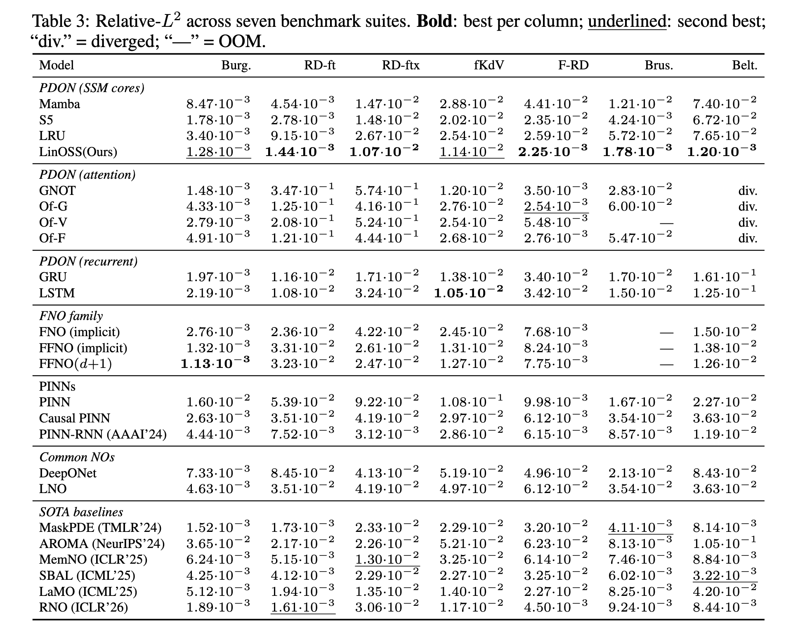

# PDON: Explicit PDE Solver

Model Introduction: PDON first compresses high-dimensional spatial snapshots into a low-dimensional latent coefficient sequence.
A temporal core then advances these coefficients through time, so the model learns dynamics in latent space rather than fitting the whole space--time grid at once. Finally, PDON decodes the evolved latent states back to the physical field, producing the full predicted PDE trajectory.

<!-- - **Main document**: [`sources/Web/main.pdf`](sources/Web/main.pdf) -->

[](sources/Web/main.pdf)

## Sequence Generation: Beltmari 3D and 2D




## Repository layout 

- **`Beltrami/`**: Beltrami-flow experiments. Main entrypoint: `Beltrami/main_beltrami.py`
- **`Brusselator/`**: 3D Brusselator experiments. Main entrypoint: `Brusselator/main_Brusselator_3d.py`
- **`Burger_RD_FkdV/`**: 2D Burgers + related settings. Main entrypoints: `Burger_RD_FkdV/main_burgers.py`, `Burger_RD_FkdV/main_fkdv.py`
- **`RD2D/`**: 2D reaction–diffusion experiments. Main entrypoint: `RD2D/main_reaction_diffusion.py`
- **`sources/Web/`**: pre-rendered visuals used in this README.

## Run experiments 

One-line runs:

```bash
python Beltrami/main_beltrami.py --model OSS
python Brusselator/main_Brusselator_3d.py --model OSS
python Burger_RD_FkdV/main_burgers.py --model OSS
python RD2D/main_reaction_diffusion.py --model OSS
```

## Key arguments 

- **`--model`**: selects the temporal backbone. Common options across scripts include `OSS`, `Mamba`, `GRU`, `LSTM`.
- **`--num_epochs`**: training epochs.
- **`--batch_size`**: minibatch size.
- **`--lr`**: learning rate.

## Results


[](sources/Web/results.png)